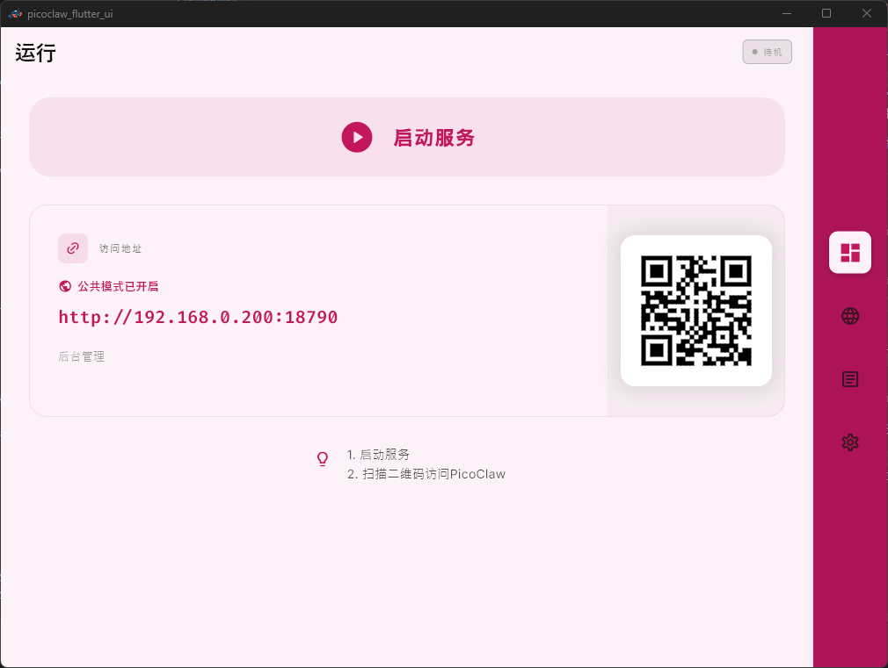

# PicoClaw Flutter UI

Uma interface de usuário moderna e multiplataforma para gerenciar o serviço `PicoClaw`. Projetada para clareza, acessibilidade, alto contraste e visualização amigável para TV/controle remoto.


## 📥 Download e introdução

Obtenha a versão mais recente em [Releases](https://github.com/sipeed/picoclaw_fui/releases/latest):

| Plataforma | Formato | Núcleo incluído |
|------------|---------|----------------|
| **Windows** | `.exe` instalador / `.zip` | Sim |
| **macOS** | `.dmg` | Sim |
| **Linux** (Ubuntu / Deepin / Debian) | `.deb` | Sim |
| **Android** (telefone / TV) | `.apk` / `.aab` | Sim |

1. Baixe e instale o pacote para sua plataforma.
2. Inicie o aplicativo.
3. Pressione **LAUNCH SERVICE** no painel — o núcleo já está incluído, nenhuma configuração adicional necessária.
4. Para mais opções, vá para a aba **Settings**.

## ✨ Recursos principais

- **Painel minimalista**: Interface limpa com tipografia de alto impacto.
- **Controles acessíveis**: Botões de ação grandes otimizados para desktop e mobile/TV.
- **Múltiplos temas de cores**: 6 paletas profissionais — Carbon, Slate, Obsidian, Ebony, Nord e SAKURA.
- **Monitoramento de logs**: Exibição de logs em tempo real com suporte à exportação.
- **Integração WebView**: Interface de gerenciamento web incorporada com orientação consciente do status.
- **Pronto para desktop**: Bandeja do sistema, aplicação de instância única e resolução automática de conflitos de porta.

## 📸 Capturas de tela

### Painel
| Status ocioso | Executando com tema SAKURA |
| :---: | :---: |
|  |  |

### Rede e gerenciamento
| Guia de serviço não iniciado | Interface web integrada (Sakura) |
| :---: | :---: |
|  |  |

### Configuração e temas
| Seleção Midnight (Carbon) | Seleção de tema Sakura |
| :---: | :---: |
|  |  |

## 🛠️ Desenvolvimento

### Pré-requisitos

- **Flutter SDK** (canal estável)
- **Binário do núcleo PicoClaw** (baixado via script auxiliar)
- Requisitos específicos da plataforma:
  - **Windows**: Visual Studio 2022 com "Desktop development with C++"
  - **Linux**: `libayatana-appindicator3-dev libgtk-3-dev pkg-config`
  - **macOS**: Xcode com direitos de rede

### Etapas de construção

A construção requer **duas etapas**: primeiro baixe o binário do núcleo `PicoClaw`, depois compile o aplicativo Flutter.

```bash
# 1. Instalar dependências
flutter pub get

# 2. Baixar o núcleo picoclaw para app/bin/
dart run tools/fetch_core_local.dart --repo sipeed/picoclaw --tag latest --out-dir app/bin

# 3. Construir e executar (exemplo para Windows)
flutter run -d windows
```

### Construção por plataforma

```bash
# Windows
dart run tools/fetch_core_local.dart --repo sipeed/picoclaw --tag latest --out-dir app/bin --platform windows --arch x86_64 --build-mode release --install-to-build
flutter build windows --release

# macOS (binário universal a partir de ambas as arquiteturas)
dart run tools/fetch_core_local.dart --repo sipeed/picoclaw --tag latest --out-dir app/bin_arm64 --platform macos --arch arm64 --build-mode release --no-install-to-build
dart run tools/fetch_core_local.dart --repo sipeed/picoclaw --tag latest --out-dir app/bin_x86_64 --platform macos --arch x86_64 --build-mode release --no-install-to-build
mkdir -p app/bin
for bin in picoclaw picoclaw-launcher; do
  lipo -create "app/bin_arm64/$bin" "app/bin_x86_64/$bin" -output "app/bin/$bin" 2>/dev/null || cp "app/bin_arm64/$bin" "app/bin/$bin"
done
flutter build macos --release

# Linux
dart run tools/fetch_core_local.dart --repo sipeed/picoclaw --tag latest --out-dir app/bin --platform linux --arch x86_64 --build-mode release --install-to-build || true
flutter build linux --release

# Android (núcleo incluído no APK/AAB via --install-to-build)
dart run tools/fetch_core_local.dart --repo sipeed/picoclaw --tag latest --out-dir app/bin --platform android --arch arm64 --build-mode release --install-to-build
flutter build appbundle --release --target-platform android-arm,android-arm64
flutter build apk --release --target-platform android-arm,android-arm64
```

Para requisitos detalhados da plataforma, consulte [docs/BUILD_GUIDE.md](docs/BUILD_GUIDE.md).

---

## 🔧 Auxiliar de binário do núcleo

O script `tools/fetch_core_local.dart` baixa o binário do núcleo `picoclaw` do GitHub Releases:

```bash
# Padrão: baixar para plataforma host
dart run tools/fetch_core_local.dart

# Especificar plataforma e arquitetura explicitamente
dart run tools/fetch_core_local.dart \
    --repo sipeed/picoclaw \
    --tag latest \
    --out-dir app/bin \
    --platform windows \
    --arch x86_64

# Usar --install-to-build para copiar o binário para o diretório de saída de construção do Flutter
--install-to-build
```

**Opções:**
- `--repo` — Repositório GitHub (padrão: `sipeed/picoclaw`)
- `--tag` — Tag de release (padrão: `latest`)
- `--platform` — `windows`, `macos`, `linux`, `android`
- `--arch` — `x86_64`, `arm64` (necessário quando `--platform` é definido)
- `--install-to-build` — Copiar binário para o diretório de saída de construção
- `--github-token` — Passar token do GitHub para limites mais altos (ou definir variável de ambiente `GITHUB_TOKEN`)
- `--dry-run` — Visualizar etapas sem executar

Veja `dart run tools/fetch_core_local.dart --help` para a lista completa de opções.

## 📄 Licença

Licença MIT. Consulte [LICENSE](LICENSE) para detalhes.
